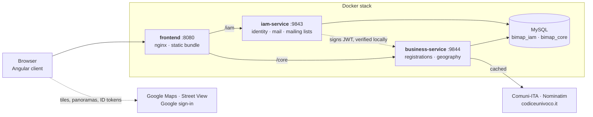

# BiMap

A field instrument for registering Italian cadastral and heritage assets.

A surveyor stands in front of a building with a phone or a tablet, drops a pin on the map, checks
the façade in Street View, and works down a guided form — region, province, comune, street, postal
code, asset, responsible body — where every answer narrows the next from live public data. Behind
the form, reviewers verify registrations, administrators run accounts, mail and mailing lists, and
the platform reports its own health in real time.

**Try it without installing anything:** [krishnapilato.github.io/bimap](https://krishnapilato.github.io/bimap/)
— the demo runs the real client against an in-browser backend with sample data, signed in as an
administrator.

**Angular 22 · Java 26 · Spring Boot 4 · MySQL · Leaflet · Google Street View · Docker**

---

## What it does

| Area | What people do there |
|---|---|
| **Survey** | Place the asset on a full-screen map, look at it in Street View side by side, and fill a form whose every field suggests from live Italian geography. Work in progress is kept on the device until it is saved. |
| **Registry** | Search, filter and review every registration as a table, cards or a map; verify, send back, archive; export CSV. |
| **Geography** | Walk Italy from region to province to comune: codes to copy, streets on the map and in Street View, postal codes, public bodies. |
| **People** | Invite people, change roles, and move accounts through their lifecycle: activate, lock, disable, delete. |
| **Mail** | The delivery log of every message the platform sends, each rendered as sent, with failures explained; write a message with attachments. |
| **Audiences** | Mailing lists with double opt-in, CSV import, campaigns with a live preview, scheduling, paced sending and a delivery report. |
| **System health** | Both services live from Actuator: uptime, heap, CPU, throughput, probes, loggers and caches, with charts. |
| **Public pages** | Sign up to a list, confirm, manage or leave a subscription — no account needed. |

---

## Architecture



- The browser talks to **one origin**. nginx serves the bundle and proxies `/iam` and `/core` to the
  two services, so there is no CORS preflight and no second port to configure.
- The services **never call each other**. IAM signs a JWT; the business service verifies it with the
  same key and rebuilds the caller from its claims, so they deploy, scale and fail independently.
- Italian geography is **read live** from public registries and cached, not copied into a table
  that goes stale the day two comuni merge.

---

## Repository

| Folder | What is in it |
|---|---|
| [`frontend/`](frontend/README.md) | The Angular client: survey, registry, geography, people, mail, audiences, health, account; the design system; the demo backend; Dockerfile and nginx. |
| [`backend/`](backend/README.md) | Maven multi-module: `platform-core` (shared kernel), `iam-service`, `business-service`. |
| [`ops/`](ops/README.md) | Database initialisation, the end-to-end smoke test, a Google sign-in test page. |
| `.github/workflows/` | CI for the client, and the GitHub Pages deployment of the demo. |
| `docker-compose.yml` | The whole stack, production-like. |
| `docker-compose.dev.yml` | Only MySQL and Mailpit, for running the services from an IDE. |

---

## Getting started

### 1. The demo, in a browser

Open [krishnapilato.github.io/bimap](https://krishnapilato.github.io/bimap/). Or run it locally:

```bash
cd frontend && npm ci && npm run start:demo
```

### 2. The whole stack, with Docker

```bash
docker compose up -d --build
```

Every value has a local default, so a fresh clone comes up on <http://localhost:8080> with nothing
to create first. Those defaults are for a laptop. Before any real deployment:

```bash
cp .env.example .env
openssl rand -base64 64      # a value for BIMAP_JWT_SECRET
```

### 3. Development

```bash
docker compose -f docker-compose.dev.yml up -d                              # MySQL :3306, Mailpit :8025
cd backend && ./mvnw spring-boot:run -pl iam-service -Dspring-boot.run.profiles=dev
cd backend && ./mvnw spring-boot:run -pl business-service -Dspring-boot.run.profiles=dev
cd frontend && npm ci && npm start                                          # http://localhost:4200
```

The Angular dev server proxies `/iam` and `/core` to the two services, exactly as nginx does in the
stack. The [backend](backend/README.md) and [frontend](frontend/README.md) READMEs cover every option.

---

## Security, stated plainly

- **Encryption in transit depends on how it is served.** The Docker stack speaks plain HTTP on
  `:8080`; nothing is encrypted on the wire until it sits behind a proxy or load balancer that
  terminates TLS. Do that before exposing it anywhere, then enable the `Strict-Transport-Security`
  line in [`frontend/nginx.conf`](frontend/nginx.conf).
- **Passwords** are stored as bcrypt hashes, never in a readable form, and never sent to Google.
- **Tokens are signed, not encrypted.** Access tokens (15 minutes) and refresh tokens (30 days) are
  HS512 JWTs: tamper-proof, but anyone holding one can read its claims — the email address, name,
  role and permissions, and nothing secret. Refresh tokens rotate, and replaying a used one revokes
  every session.
- **Sign-in resists guessing:** temporary lockout after repeated failures, and identical answers for
  an unknown address and a wrong password.
- **Email content cannot run code in the app.** Messages and campaign previews render in a sandboxed
  frame without scripts.
- **Mailing lists respect consent:** double opt-in by default, an unsubscribe link in every
  campaign, and imports never resubscribe someone who left.
- The Google Maps key in the client is public by design; restrict it by HTTP referrer in Google
  Cloud to the origins that serve the app.

---

## Testing

| What | How |
|---|---|
| Backend unit tests | `cd backend && ./mvnw test` |
| Client unit tests (Vitest) | `cd frontend && npm test -- --watch=false` |
| End to end, against a running stack | `bash ops/smoke-test.sh` |

The client workflow runs its tests and builds both the live and the demo bundle on every pull
request, and deploys the demo to GitHub Pages from `main`.

---

## Google setup

Both live in one Google Cloud project, under **APIs & Services → Credentials**.

1. **Sign-in.** The OAuth 2.0 client must be of type *Web application*, and its id must match in
   `frontend/src/environments/` and in `GOOGLE_CLIENT_ID` for the IAM service. Under **Authorised
   JavaScript origins**, add every address the client is opened from, exactly as the address bar
   shows it (scheme and port included, no path): `http://localhost`, `http://localhost:4200`,
   `http://localhost:8080`, and the address of any server running the live build. No redirect URI is
   needed, because sign-in happens in a popup.
2. **Consent screen** (Google Auth Platform → Audience). The user type must be *External* unless
   everyone signs in with an account from the organisation that owns the project; *Internal* refuses
   personal accounts with *Error 403: org_internal*. While the app is in *Testing*, only its test
   users can sign in: add yourself, or publish it (the basic scopes sign-in uses need no
   verification).
3. **Maps and Street View.** Allow the same addresses, plus `https://krishnapilato.github.io/*` for
   the demo, in the API key's HTTP referrer restrictions, with the Maps JavaScript API enabled.

If Google's popup says *Error 401: invalid_client — no registered origin*, step 1 is missing for the
address in use. Changes can take a few minutes to reach Google's servers.

---

## Credits

The Italian reference data is not ours. It comes from
**[Comuni-ITA](https://github.com/Samurai016/Comuni-ITA)** (regions, provinces, comuni, ISTAT and
cadastral codes, MIT), **[Nominatim / OpenStreetMap](https://nominatim.openstreetmap.org/)**
(addresses and coordinates, ODbL 1.0) and **[codiceunivoco.it](https://codiceunivoco.it)** (public
bodies and electronic invoicing codes). Map tiles and Street View imagery are © Google. Icons are
[Lucide](https://lucide.dev) (ISC).

## Author

**Khova Krishna Pilato** — [github.com/krishnapilato](https://github.com/krishnapilato)
