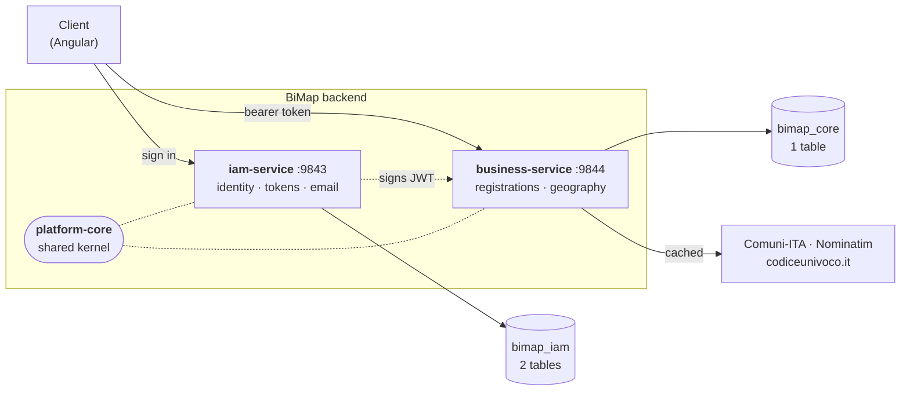

# BiMap

A field instrument for Italian cadastral and heritage asset registration.

A surveyor stands in front of a building, works down a guided form — region, province, comune,
street, postcode, asset, responsible body — and every step narrows the next from live public
data. The backend behind that is two Spring Boot services and a shared kernel.

**Java 26 · Spring Boot 4.2.0-M1 · MySQL 26.7 · Maven multi-module**

---

## Architecture



The dotted line from IAM to the business service is **not** a network call. IAM signs a JWT; the
business service verifies it locally with the same key and rebuilds the caller from its claims.
Neither service calls the other, so they deploy, scale and fail independently.

| Module | What it owns |
|---|---|
| **`platform-core`** | JWT issuing and verification, the request/principal context, RFC 7807 error handling, correlation ids, the operator landing and error pages, the logging configuration. Auto-configured into both services. |
| **`iam-service`** | Registration and activation, JWT sign-in and refresh, Google sign-in, password recovery, the account lifecycle, transactional email. **Knows nothing about cadastral registration** — lift the module out and it is a ready-made IAM starter for the next project. |
| **`business-service`** | Asset registrations with their dynamic form schema and dynamic table queries, plus the Italian geography cascade and third-party code lookups. |

---

## The guided cascade

The registration form is a chain, and each step filters the one below it. Every filter is
optional, so each endpoint also works standalone.

```
region → province → municipality → address → postcode → asset name → ISTAT code → responsible body
```

```http
GET /api/v1/geo/regions?q=lomb
GET /api/v1/geo/provinces?q=va&region=Lombardia          # never offers Verona
GET /api/v1/geo/municipalities?q=vare&region=Lombardia&province=VA
GET /api/v1/geo/addresses?street=Via+Sacco&municipality=Varese
GET /api/v1/geo/postal-codes?municipality=Varese
GET /api/v1/geo/entity-codes?q=Archivio+di+Stato&municipality=Varese
```

The client does not hard-code that order. `GET /api/v1/registrations/schema/form` returns the
field list, the validation patterns, the lookup URL each autocomplete should call, and a
`cascade` array giving the sequence — so changing the flow is a server-side edit.

### Why the geography is cached, not bundled

The upstream has no server-side search: `/comuni` is one ~3 MB document for the whole country,
and `?nome=` does not filter. Calling it per keystroke would download 3 MB per character typed.
Committing a copy of the dataset instead would go stale the moment two comuni merge.

So the live API is the source of truth and answers are cached with a configurable TTL (24 h by
default). Set `COMUNI_ITA_CACHE_TTL=0s` and every request goes straight upstream. Filtering and
the row limit happen here, using a bounded top-N stream gatherer that never sorts all 7,894
municipalities to return five.

---

## Getting started

### With Docker (the whole stack)

```bash
cp .env.example .env
```

Edit `.env` — at minimum `MYSQL_ROOT_PASSWORD`, `DB_PASSWORD` and `BIMAP_JWT_SECRET`. Generate a
signing key with:

```bash
openssl rand -base64 64 | tr -d '\n'
```

```bash
docker compose up -d --build
```

MySQL, both services and their schemas come up together. IAM on `:9843`, business on `:9844`.

### Locally (services from your IDE)

Start only the infrastructure:

```bash
docker compose -f docker-compose.dev.yml up -d
```

That gives MySQL on `:3306` and [Mailpit](http://localhost:8025) catching every outgoing email.
Then, from `backend/`:

```bash
./mvnw spring-boot:run -pl iam-service -Dspring-boot.run.profiles=dev
```

```bash
./mvnw spring-boot:run -pl business-service -Dspring-boot.run.profiles=dev
```

No Maven install needed — the wrapper fetches it. You need a JDK 26 and nothing else.

### Without Docker

Create the two schemas and a user, then run the same two commands with `DB_USERNAME` and
`DB_PASSWORD` set:

```sql
CREATE DATABASE bimap_iam  CHARACTER SET utf8mb4 COLLATE utf8mb4_0900_ai_ci;
CREATE DATABASE bimap_core CHARACTER SET utf8mb4 COLLATE utf8mb4_0900_ai_ci;
CREATE USER 'bimap'@'%' IDENTIFIED BY 'your-password';
GRANT ALL PRIVILEGES ON bimap_iam.*  TO 'bimap'@'%';
GRANT ALL PRIVILEGES ON bimap_core.* TO 'bimap'@'%';
```

Flyway creates the tables on first start.

---

## Environment variables

Nothing sensitive is committed. Every value below has a development default, and the ones marked
**required** must be set before a real deployment.

### Both services

| Variable | Required | Default | Purpose |
|---|:---:|---|---|
| `BIMAP_JWT_SECRET` | **yes** | dev placeholder | HMAC signing key. **Identical in both services**, minimum 64 characters — a shorter one refuses to boot. |
| `BIMAP_JWT_ISSUER` | | `bimap` | `iss` claim, verified on every parse. |
| `DB_HOST` / `DB_PORT` | | `127.0.0.1` / `3306` | MySQL. |
| `DB_NAME` | | `bimap_iam` / `bimap_core` | One schema per service. |
| `DB_USERNAME` / `DB_PASSWORD` | **yes** | `bimap` / empty | Database credentials. |
| `DB_POOL_SIZE` | | `10` | Hikari maximum pool size. |
| `BIMAP_APP_URL` | | `http://localhost:4200` | Front end, used for links in emails. |
| `BIMAP_CORS_ORIGINS` | | `http://localhost:4200` | Comma-separated exact origins. |
| `SPRING_PROFILES_ACTIVE` | | none | `dev` locally, `prod` in deployment. |
| `LOG_LEVEL_ROOT` / `LOG_LEVEL_APP` | | `INFO` | Logging. `LOG_LEVEL_SQL`, `LOG_LEVEL_SECURITY` also available. |
| `LOG_PATH` | | `logs` | Where the rolling files go. |

### IAM service only

| Variable | Required | Default | Purpose |
|---|:---:|---|---|
| `IAM_SERVER_PORT` | | `9843` | HTTP port. |
| `MAIL_HOST` / `MAIL_PORT` | **yes** | Mailtrap sandbox / `587` | SMTP relay. |
| `MAIL_USERNAME` / `MAIL_PASSWORD` | **yes** | empty | SMTP credentials. |
| `MAIL_FROM` / `MAIL_FROM_NAME` | | `no-reply@bimap.local` / `BiMap` | Envelope sender. |
| `MAIL_ENABLED` | | `true` | `false` logs messages instead of sending them. |
| `BIMAP_SEED_ENABLED` | | `true` | Seeds the five founding accounts. Idempotent. |
| `BIMAP_SEED_PASSWORD` | | empty | **Leave empty in production.** Empty means the seeded accounts are created pending activation with no password, and each person sets their own from the emailed link. Set it only for a local run where you want to sign in immediately. |
| `BIMAP_SELF_REGISTRATION` | | `true` (`false` in compose) | Whether the public sign-up endpoint accepts new accounts. |
| `BIMAP_MAX_LOGIN_ATTEMPTS` | | `5` | Failures before a temporary lockout. |
| `BIMAP_LOCKOUT_DURATION` | | `15m` | How long that lockout lasts. |
| `BIMAP_ACCESS_TOKEN_TTL` | | `15m` | Access token lifetime. |
| `BIMAP_REFRESH_TOKEN_TTL` | | `30d` | Refresh token lifetime. |
| `GOOGLE_CLIENT_ID` | | empty | OAuth2 client id. Empty disables `/auth/google`. |
| `BUSINESS_SERVICE_URL` | | `http://localhost:9844` | Linked from the landing page. |

### Business service only

| Variable | Required | Default | Purpose |
|---|:---:|---|---|
| `BUSINESS_SERVER_PORT` | | `9844` | HTTP port. |
| `COMUNI_ITA_URL` | | `https://comuni-ita.nicolorebaioli.dev` | Geography source. |
| `COMUNI_ITA_CACHE_TTL` | | `24h` | `0s` disables caching. |
| `NOMINATIM_URL` | | `https://nominatim.openstreetmap.org` | Address resolution. |
| `NOMINATIM_CACHE_TTL` | | `12h` | Nominatim asks for ≤ 1 request/second; the cache is what keeps us inside that. |
| `CODICE_UNIVOCO_URL` | | `https://codiceunivoco.it` | Public-body directory. |
| `CODICE_UNIVOCO_CACHE_TTL` | | `12h` | |
| `INTEGRATION_USER_AGENT` | | `BiMap/2.0 (…)` | Sent on every outbound call. Nominatim requires an identifiable one. |
| `IAM_SERVICE_URL` | | `http://localhost:9843` | Linked from the landing page. |

---

## What you get when it is running

| | IAM `:9843` | Business `:9844` |
|---|---|---|
| Landing page | <http://localhost:9843/> | <http://localhost:9844/> |
| API reference | `/swagger-ui.html` | `/swagger-ui.html` |
| Health | `/actuator/health` | `/actuator/health` |
| Live metrics feed | `/api/platform/runtime` | `/api/platform/runtime` |

Each service publishes its **own** OpenAPI document — the geography endpoints live on `:9844`,
not `:9843`. The landing pages link to each other so neither port has to be remembered.

The landing page is not decoration: it reads real Actuator health indicators and Micrometer
meters (uptime, heap, CPU, threads, request counts and latency, connection pool) and refreshes
every five seconds, pausing while the tab is hidden. It and the error page are public — an
operator should never need a token to see whether the service is alive.

---

## Database

Three domain tables. That is the whole schema.

| Schema | Table | Grows with |
|---|---|---|
| `bimap_iam` | `user_account` | people |
| `bimap_iam` | `security_token` | sign-ins and refreshes — the only table that really grows, swept nightly |
| `bimap_core` | `asset_registration` | submitted registrations |

There is no `listacomuni` table and no `tables` table. The geography is read from a live API, and
what used to be two disconnected tables — a submitted form and a separate protection record for
the same building — is now one `asset_registration` aggregate.

Flyway owns the schema; Hibernate runs with `ddl-auto=validate` and only checks that the mapping
still matches. `update` is not something to point at a production database.

---

## Security

- **Stateless JWT.** Access token 15 min, refresh token 30 days, both HS512, both carrying the
  caller's role and fine-grained permissions so the business service authorises without a lookup.
- **Refresh token rotation with reuse detection.** Every refresh returns a new token and burns the
  old one. Presenting a burned token means the same secret exists in two places, so every session
  on that account is revoked — in a separate transaction, because the 401 that follows rolls the
  request back and would otherwise undo the revocation.
- **Account lockout** after repeated failures, temporary and distinct from an administrator lock,
  so a successful password reset clears the former and not the latter.
- **No account enumeration.** A wrong password and an unknown address give byte-identical answers;
  password recovery and activation resend always report success.
- **Password policy** reports every unmet rule at once, not just the first.
- **Single-use tokens.** Activation and reset links are tracked server-side and consumed on use.
- **RFC 7807 everywhere**, with a stable `code` to branch on and an `X-Correlation-Id` on every
  response — including errors — that ties the request together across both services' logs.

---

## Testing

Unit tests:

```bash
cd backend && ./mvnw test
```

74 tests covering token issuing and verification (signature, issuer, expiry, type confusion),
the password policy, the account lifecycle and lockout semantics, the error catalogue, and the
search ranking and bounded top-N gatherer.

End to end, against a running stack:

```bash
bash ops/smoke-test.sh
```

102 checks across both services, including every path that is supposed to fail: unauthenticated
access, wrong roles, illegal lifecycle transitions, malformed input, refresh-token replay and
forged tokens. It calls the live upstream APIs, so it also tells you when Comuni-ITA, Nominatim or
codiceunivoco.it are having a bad day.

### Google sign-in

The backend holds **no client secret**. Google issues an ID token to the browser, the browser
posts it to `/api/v1/auth/google`, and the server verifies it against Google and checks that the
`aud` claim matches `GOOGLE_CLIENT_ID`. There is no authorization-code exchange, so there is
nothing secret to leak.

To try it end to end, add `http://localhost:8080` to the OAuth client's authorised JavaScript
origins, then serve the test page:

```bash
npx --yes http-server ops -p 8080
```

and open <http://localhost:8080/google-signin-test.html>.

---

## Notable Java 26 usage

Everything below is a finalised feature — no `--enable-preview`, so the move to Java 27 is a
one-line change to `<java.version>` in the parent POM and the `JAVA_VERSION` build argument.

- **`ScopedValue`** carries the request context. It survives the hop onto virtual threads without
  an inheritable-thread-local leak, and cannot outlive the request.
- **Virtual threads** for the HTTP server and for `@Async` email, which is almost entirely socket
  wait.
- **Sealed interfaces and record patterns** — `TokenVerification` models verification as data, and
  the filter switches over it exhaustively, so expiry and a bad signature cannot be conflated.
- **Sealed exception hierarchy** — the error handler switches over it exhaustively, so a new
  failure type cannot be added without deciding how it is logged.
- **Stream gatherers** — a bounded top-N gatherer returns the best five matches without sorting
  eight thousand rows.
- **Records** for every DTO, value object and configuration binding.
- **Markdown Javadoc** (`///`) throughout.

---

## Credits

The Italian reference data served by this API is not ours. It comes from:

- **[Comuni-ITA](https://github.com/Samurai016/Comuni-ITA)** — regions, provinces, municipalities,
  ISTAT and cadastral codes. *MIT.*
- **[Nominatim / OpenStreetMap](https://nominatim.openstreetmap.org/ui/search.html)** — address
  resolution, postcodes, coordinates. *ODbL 1.0.*
- **[codiceunivoco.it](https://codiceunivoco.it)** — Italian public-body directory and electronic
  invoicing codes.

These are credited on every landing page and in the OpenAPI description, generated from the same
configuration so the two can never disagree.

---

## Author

**Khova Krishna Pilato** — [github.com/krishnapilato](https://github.com/krishnapilato)
