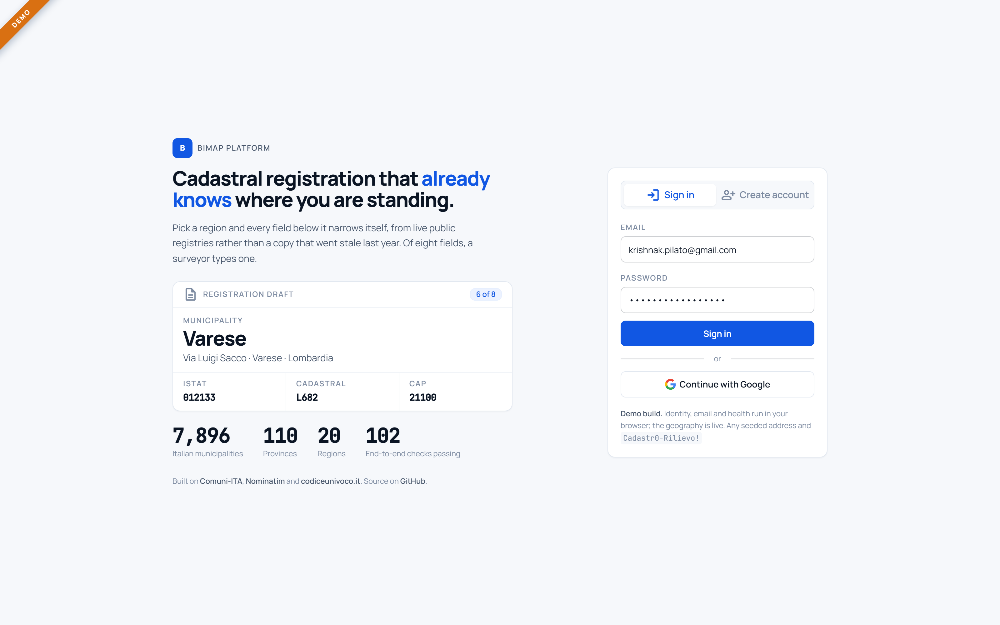
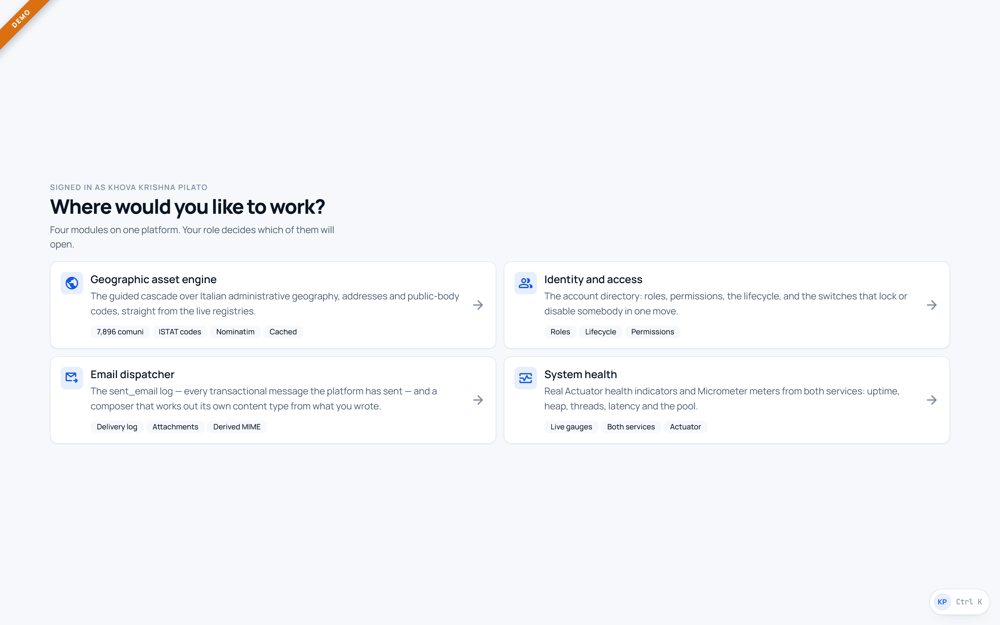
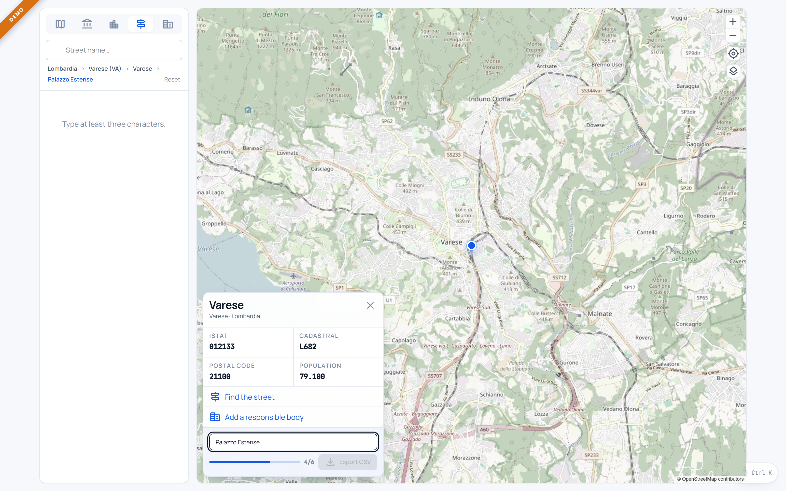
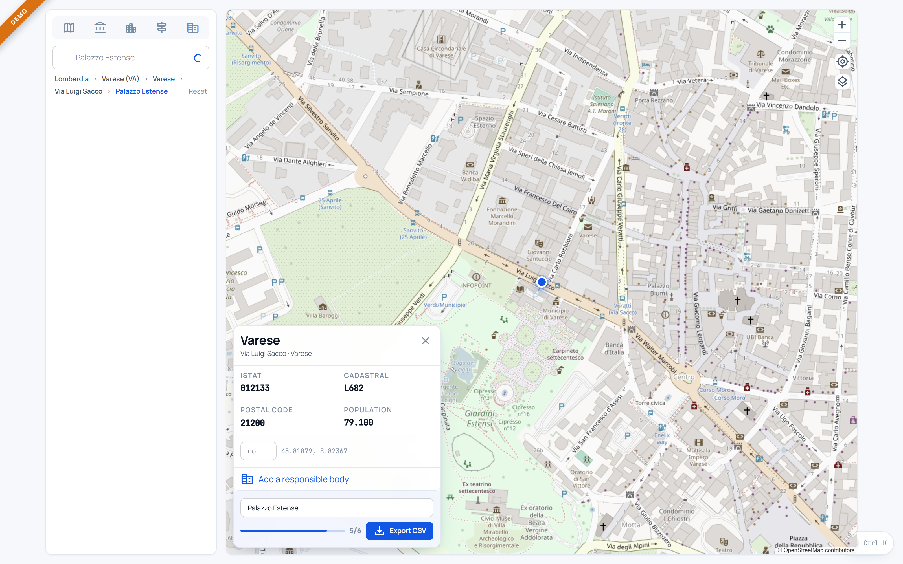
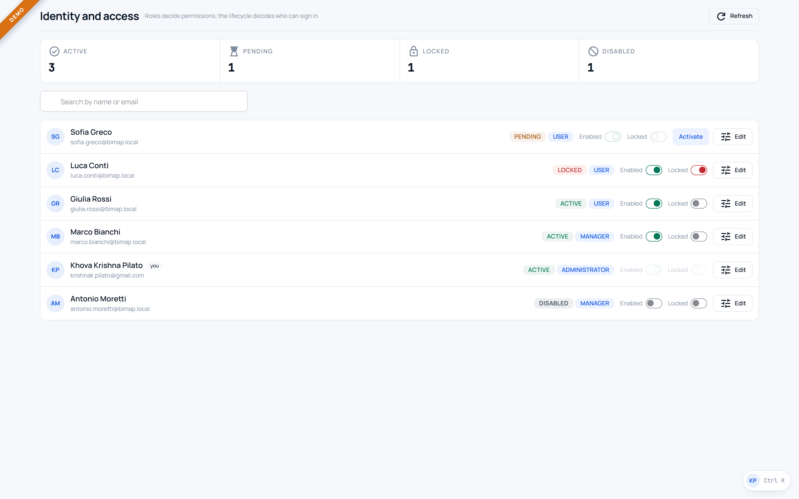
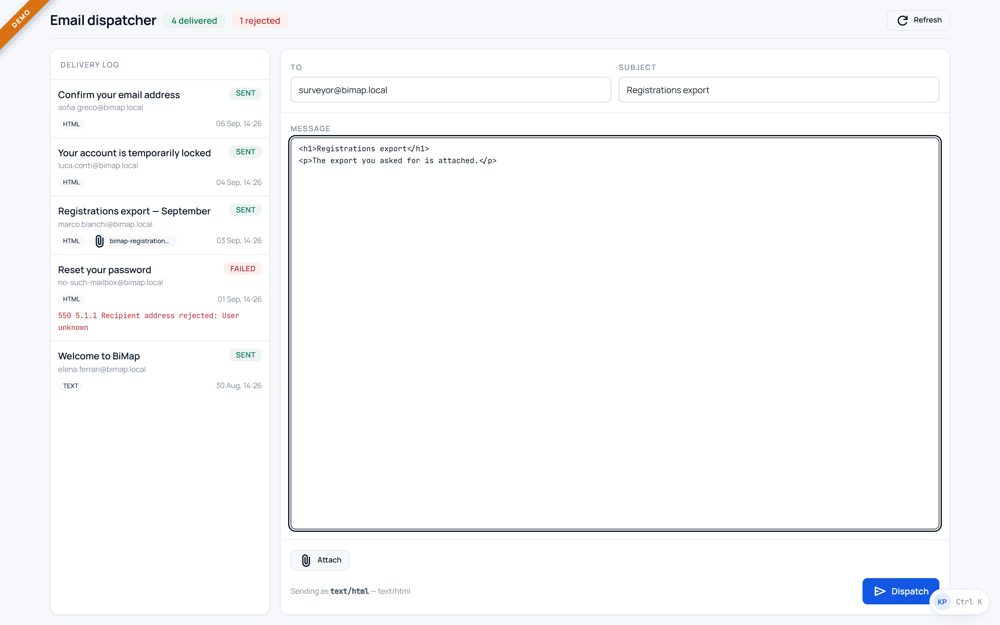
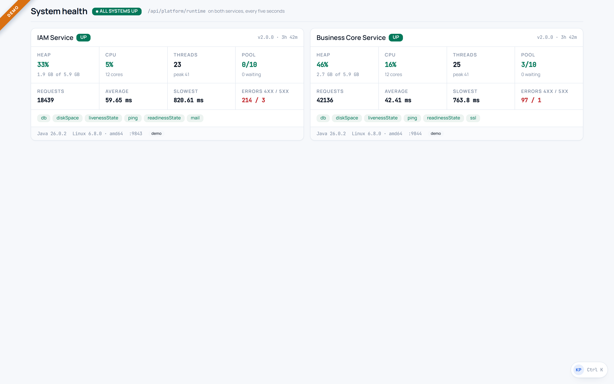
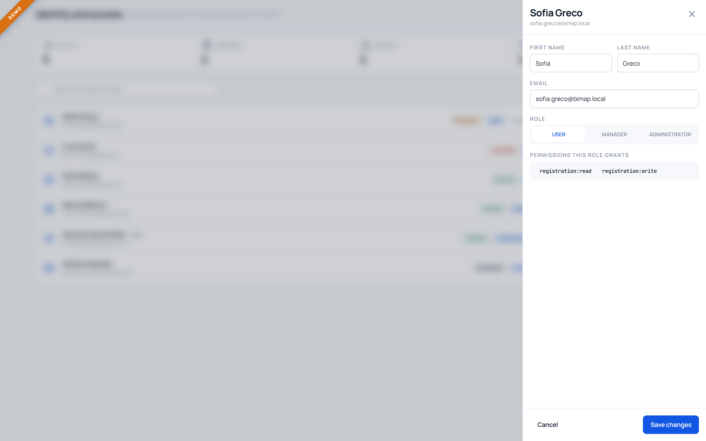

# BiMap — Frontend

The Angular client. One light theme, no navbar, no footer, and a dual-mode API layer that lets the
same build run against the live Spring Boot services or entirely inside the browser.

**Angular 22 · TypeScript 6 · Tailwind CSS 4 · daisyUI 5 · GSAP 3**

---

## Dual-mode API

Every feature depends on an interface, never on an implementation:

```
AUTH_API   GEO_API   IAM_API   EMAIL_API   HEALTH_API   REGISTRY_API
```

Which implementation arrives is decided once, in `core/api/api.providers.ts`, from
`environment.appMode`. Angular's `fileReplacements` swaps the environment at build time — the
equivalent of a Vite `import.meta.env`, and the DI container plays the part a React
`EnvironmentContext` would.

| Module | `live` | `demo` (GitHub Pages) |
|---|---|---|
| Auth | IAM service `:9843` | localStorage, real 6-digit OTP flow |
| Geo | business-core `:9844` | **the real public APIs, called directly** |
| IAM | IAM service | localStorage, lifecycle rules enforced |
| Email | `/api/v1/notifications` | localStorage log |
| Health | `/api/platform/runtime` on both | drifting synthetic meters |
| Registry | `POST /registrations` | **downloads a CSV** |

Two of those deserve the emphasis.

**Geography is never faked.** Comuni-ITA, Nominatim and codiceunivoco.it all send
`Access-Control-Allow-Origin: *`, so the static build calls them from the browser. `PublicGeoAdapter`
then does what the backend normally does — folds accents away, ranks prefix matches above mid-word
ones, cuts to five — because inventing municipalities would make the whole cascade a lie.

**A demo save is honest about itself.** There is no database on GitHub Pages, so rather than showing
a green tick and dropping the surveyor's work, the registration comes back as a CSV with the same
columns the server exports.

The payoff: no component contains a mode check.

---

## The guided cascade

`/geo` is a split view. One instant-search box on the left, and on the right the map it moves with
the record being assembled underneath.

```
region → province → municipality → address → asset name → responsible body
```

Each level narrows the next, and a level stays locked until the one above it is answered — an
unnarrowed lookup would offer impossible options. Only the asset name is typed unaided.

The map is Leaflet on CARTO's Positron tiles, lazy-loaded so it costs nothing on the other five
routes. Its marker is a plain element rather than Leaflet's sprite, which keeps the product accent
and sidesteps the icon-path problem bundlers always have with Leaflet's images. The wheel does not
zoom: on a page where scrolling means something, a map that swallows the wheel is a trap.

Below `lg` the two panes take turns behind a tab rather than squeezing together.

---

## Layout

Every view is exactly one screen tall. Pages grow a scrollbar only when they genuinely have more
than a screen to say; panes that hold lists scroll inside themselves, which is overflow with a
reason. Scrollbars are hidden throughout — scrolling still works, the gutter simply never draws.

Nothing is sized in fixed pixels. Every dimension is `rem`, `%` or `clamp()`, so the same markup
fits a 320px phone and a 4K display.

The landing page is one horizontal rail: each section is a panel one screen wide and one screen
tall, and vertical scroll drives them sideways. Below the breakpoint the same markup becomes a
swipeable snap track. Two details are easy to get wrong and worth naming:

- **`body` uses `overflow-x: clip`, never `hidden`.** Hidden on one axis forces the other to compute
  to `auto`, which turns the body into its own scroll container and leaves window-driven scrolling
  dead — and with it the pin.
- **There is no `scroll-behavior: smooth`.** It fights ScrollTrigger, which samples the scroll
  position every frame and desynchronises from a scroll the browser is still easing. Smoothness is
  asked for per call, where it is actually wanted.

---

## The composer decides its own format

`/email` has no HTML / plain-text switch. You write one message and attach what you like; the MIME
type is derived from what is actually there — markup makes it `text/html`, prose makes it
`text/plain`, and either becomes `multipart/mixed` the moment a file is attached. That is what a
mail library would decide anyway, so asking the sender to declare it separately only creates a way
to get it wrong. The resolved type is shown above the send button.

---

## Running it

```bash
npm install
```

| Command | What it does |
|---|---|
| `npm start` | Dev server against `localhost:9843` / `:9844` |
| `npm run start:demo` | Dev server in demo mode, no backend needed |
| `npm run build` | Production bundle, expects `/iam` and `/core` behind a proxy |
| `npm run build:demo` | Static GitHub Pages bundle, `baseHref=/bimap/` |

In demo mode any seeded address signs in with `Cadastr0-Rilievo!`, and a fresh sign-up walks the
real activation flow — the code is printed to the console and offered in the modal, because there
is no mailbox to deliver it to.

---

## Structure

```
src/app/
  core/
    api/
      models.ts         every shape the UI speaks in
      adapters.ts       the six ports, and their InjectionTokens
      api.providers.ts  the one place live and demo diverge
      http/             adapters against the real services
      mock/             adapters backed by localStorage
    motion/motion.ts    GSAP directives, including the horizontal rail
    session.service.ts  who is signed in, as signals
    guards.ts           route guards
  features/
    landing  hub  geo  iam  email  health
  shared/
    avatar-menu         the only chrome in the application
    map-panel           Leaflet, loaded on demand by /geo
```

---

## Angular 22

- **Zoneless.** `provideZonelessChangeDetection()` — everything is signals, so there is nothing for
  Zone.js to do.
- **Signals throughout.** `signal`, `computed`, `input()`, `output()`, `viewChildren()`,
  `toSignal`/`toObservable`. No `async` pipe, no manual subscription to leak.
- **New control flow** — `@if`, `@for`, `@switch`, `@let` — in every template.
- **Standalone components**, lazy per route, so the landing page carries no module code.

## Design

Light only, no toggle: this is a field instrument read in daylight. daisyUI supplies the semantic
classes (`btn`, `badge`, `toggle`, `tabs`, `radial-progress`) so markup stays legible, but every
colour is overridden with the BiMap palette — the same one the Spring Boot operator pages use, so
the product looks like one thing from the landing page to the actuator dashboard.

GSAP scroll animations use `toggleActions: 'play reverse play reverse'`, so they play on the way
down **and** reverse on the way back up. `prefers-reduced-motion` skips them entirely.

---

## Docker

```bash
docker build -t bimap/frontend .
```

Two stages: Node builds, nginx serves. The runtime image has no Node in it at all. nginx also
reverse-proxies `/iam` and `/core` to the two services, so the browser talks to one origin and CORS
never enters the picture.

---

**Khova Krishna Pilato** — [github.com/krishnapilato](https://github.com/krishnapilato)

---

## Screenshots

<table>
  <tr>
    <td width="50%"><br><sub><b>The rail begins.</b> Vertical scroll drives it sideways.</sub></td>
    <td width="50%"><br><sub><b>The hub.</b> Your role decides which of the four opens.</sub></td>
  </tr>
  <tr>
    <td><br><sub><b>Split view.</b> Search left, map and record right.</sub></td>
    <td><br><sub><b>Street resolved.</b> The marker follows the cascade.</sub></td>
  </tr>
  <tr>
    <td><br><sub><b>The directory.</b> Status and role on every card.</sub></td>
    <td><br><sub><b>No format to pick.</b> The MIME type is derived.</sub></td>
  </tr>
  <tr>
    <td><br><sub><b>Live Actuator meters</b> from both services.</sub></td>
    <td><br><sub><b>The drawer.</b> Role, and the permissions it grants.</sub></td>
  </tr>
</table>
